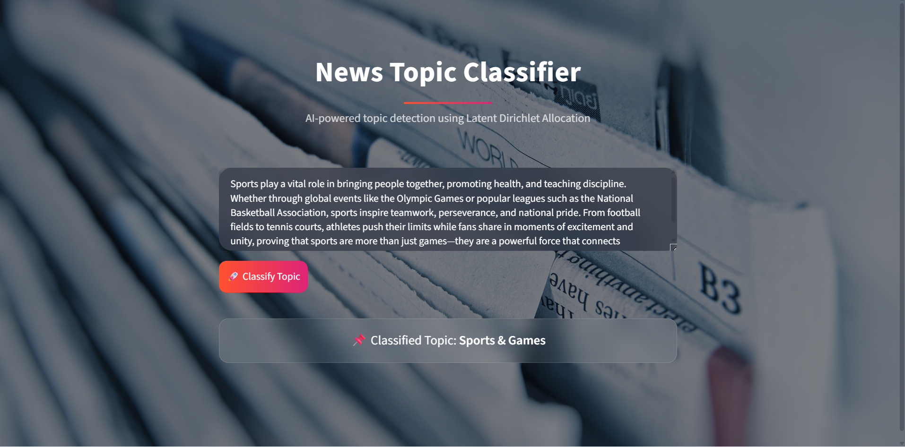

<!-- Animated Banner -->
<h1 align="center">🚀 LDA Topic Classifier Web App</h1>

<p align="center">

</p>

---

<p align="center">


</p>

---

# 🌟 Project Overview

✨ This project is an **AI-powered Topic Classifier** built using the **Latent Dirichlet Allocation (LDA)** algorithm.

It automatically detects the hidden topic from text using **Natural Language Processing and Machine Learning**.

The project also includes a **beautiful and interactive Streamlit Web Interface** for real-time topic prediction.

---

# 🎬 Streamlit Interface Preview

<p align="center">

</p>

---


# 🧠 Model Workflow Animation

```mermaid
flowchart TD

A[User Input Text] --> B[Text Cleaning]
B --> C[Tokenization]
C --> D[Stopword Removal]
D --> E[Vectorization]
E --> F[LDA Model]
F --> G[Topic Probability]
G --> H[Predicted Topic]
H --> I[Streamlit Display]
